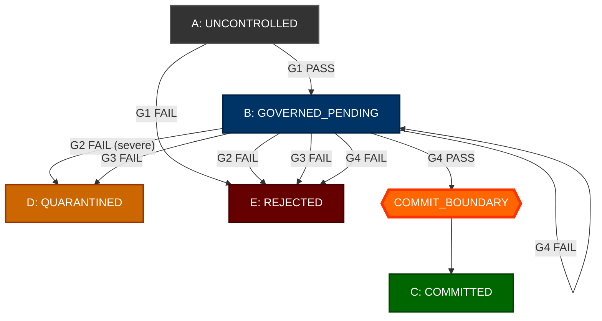

# LV/TECH — RUNTIME GOVERNANCE GEOMETRY: DIAGRAM v0.1

Canonical Mermaid diagram for the runtime governance geometry.

GitHub renders this automatically in markdown preview.

## Flow direction

- **Top to Bottom** = increasing containment
- **Left to Right** = increasing irreversibility
- Only **G4 PASS** crosses the COMMIT_BOUNDARY

## Diagram

## Legend

| Symbol | Meaning |
|--------|---------|
| **A** | Uncontrolled: pre-governance, no binding |
| **B** | Governed/Pending: evaluated, not committed |
| **C** | Committed: system-of-record changed |
| **D** | Quarantined: blocked/held for investigation |
| **E** | Rejected: dropped, no side-effects |
| **CB** | COMMIT_BOUNDARY: crossed only via G4 PASS; one-way |
| G1–G4 | Deterministic gates with PASS/FAIL outcomes |
| Solid arrow | Deterministic transition |

## Invariants (visual check)

- [ ] No arrow reaches C except through CB (G4 PASS)
- [ ] All FAIL arrows point to D or E
- [ ] CB is visually distinct (orange/heavy)
- [ ] No arrow from D or E leads to C

---

**END DIAGRAM — v0.1**
